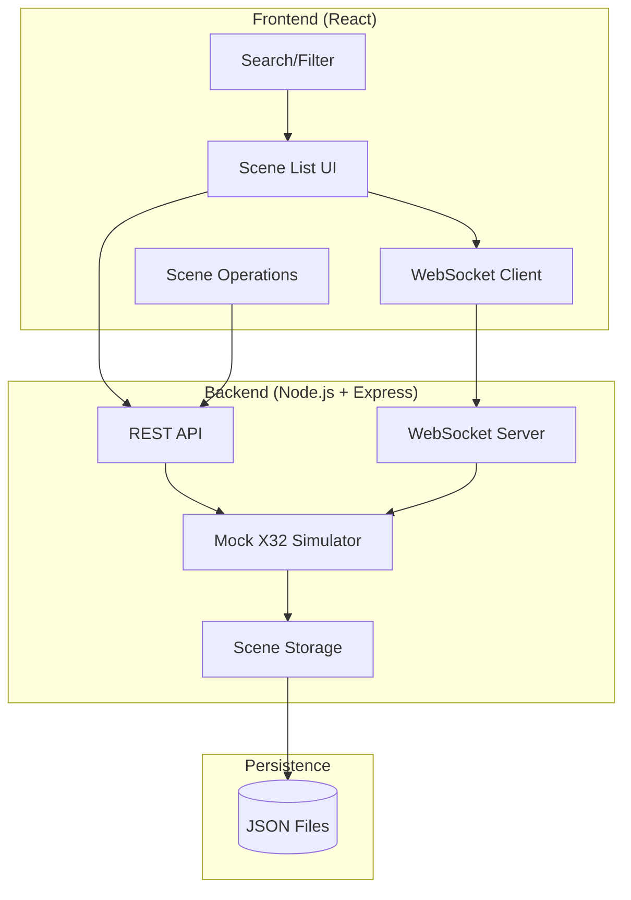

# PLAN Phase Summary

**Project**: X32 Scene Manager
**Phase**: PLAN (Planning)
**Status**: COMPLETED
**Date**: 2025-12-07
**Architect**: Claude Opus 4.5

---

## Overview

The PLAN phase has successfully defined the foundation for the X32 Scene Manager MVP. This phase established clear requirements, scope boundaries, and actionable implementation tasks.

---

## Deliverables

### 1. Requirements Specification
**File**: `C:\home\repos\x32-ui\docs\requirements.md`

Comprehensive requirements document including:
- **10 Functional Requirements** covering all scene management operations
- **9 Non-Functional Requirements** for performance, usability, security
- **7 Technical Constraints** defining limitations and boundaries
- **8 Assumptions** about environment and usage
- **7 Success Criteria** for MVP acceptance

**Key Highlights**:
- Touch-friendly UI with 44x44px minimum touch targets
- Scene operations complete in < 1 second perceived time
- Support for 100 scenes (X32 hardware limit)
- Mock-only mode for Phase 1 (no real X32 hardware)
- Docker deployment on Unraid server

---

### 2. Scope Definition
**File**: `C:\home\repos\x32-ui\docs\scope.md`

Clear boundaries between in-scope and out-of-scope features:

**In Scope (MVP)**:
- Core scene management (list, load, save, create, delete)
- Mock X32 simulator with OSC protocol emulation
- Real-time WebSocket updates
- Touch-optimized React UI
- Docker containerized deployment
- File-based JSON storage

**Out of Scope (Future Phases)**:
- Live X32 hardware communication (Phase 2)
- Mixing controls and parameter adjustment
- User authentication and authorization
- Scene version history and templates
- Multi-user collaboration features
- Cloud sync and analytics

**Scope Metrics**:
- Estimated timeline: 3-4 weeks
- Team size: 1 developer
- Total tasks: 16 actionable items
- Target container size: < 200MB

---

### 3. Task Breakdown
**File**: `C:\home\repos\x32-ui\docs\task-breakdown.md`

Detailed implementation plan with 16 tasks organized into categories:

#### Task Categories
1. **Foundation** (2 tasks): Setup, type definitions
2. **Backend Core** (4 tasks): Storage, mock X32, API, WebSocket
3. **Frontend Core** (5 tasks): UI components, operations, search, error handling
4. **Polish & UX** (1 task): UI refinement
5. **Deployment** (2 tasks): Docker, documentation
6. **QA** (2 tasks): Testing, production deployment

#### Time Estimates
- **Total Time**: 105 hours (~13 working days)
- **Week 1**: Backend foundation (Tasks 1-6)
- **Week 2**: Frontend core (Tasks 7-10)
- **Week 3**: Integration and polish (Tasks 11-13)
- **Week 4**: Documentation and deployment (Tasks 14-16)

#### Task Dependencies
```
Setup → Types → Storage → Mock X32 → API/WebSocket
                                    ↓
                          UI Components → Operations → Polish
                                                      ↓
                                              Docker → Docs → Testing → Deploy
```

---

## Architecture Preview

### System Components



### Technology Stack Preview

**Frontend**:
- React 19 with TypeScript
- Tailwind CSS v4 for styling
- WebSocket for real-time updates
- Vite for build tooling

**Backend**:
- Node.js 22 (Alpine Linux)
- Express for REST API
- WebSocket (ws) for real-time communication
- OSC library for X32 protocol simulation

**Storage**:
- File-based JSON storage
- Docker volume for persistence

**Deployment**:
- Single Docker container (frontend + backend)
- Unraid Community Apps template
- Health check endpoint for monitoring

---

## Key Requirements Summary

### Functional Requirements

| ID | Requirement | Priority | Complexity |
|----|-------------|----------|------------|
| FR-1 | Scene List Display | MUST HAVE | M |
| FR-2 | Load Scene | MUST HAVE | M |
| FR-3 | Save Scene | MUST HAVE | M |
| FR-4 | Create New Scene | MUST HAVE | M |
| FR-5 | Delete Scene | MUST HAVE | M |
| FR-6 | Search and Filter | SHOULD HAVE | S |
| FR-7 | Mock X32 Simulator | MUST HAVE | XL |
| FR-8 | Real-time Status | SHOULD HAVE | M |
| FR-9 | Scene Metadata | COULD HAVE | S |
| FR-10 | Export/Import | COULD HAVE | L |

### Non-Functional Requirements

| Category | Requirement | Target Metric |
|----------|-------------|---------------|
| Performance | Initial page load | < 2 seconds |
| Performance | Scene operation | < 1 second |
| Usability | Touch target size | 44x44 pixels minimum |
| Usability | Typography | 16px minimum body text |
| Security | Rate limiting | 10 req/sec per client |
| Reliability | Uptime | 99% availability |
| Scalability | Max scenes | 100 (X32 limit) |
| Scalability | Concurrent users | 10 connections |
| Deployment | Container size | < 200MB |

---

## Risk Assessment

### High-Risk Items

1. **Mock X32 Simulator Complexity**
   - Risk: OSC protocol implementation more complex than estimated
   - Impact: 2-3 day delay
   - Mitigation: Implement minimal commands first, iterate later

2. **Unraid Deployment Issues**
   - Risk: Platform-specific Docker issues
   - Impact: 1-2 day delay
   - Mitigation: Test on Unraid during Week 2

3. **WebSocket Scalability**
   - Risk: Performance issues with multiple clients
   - Impact: Poor UX with concurrent users
   - Mitigation: Limit to 10 connections, optimize broadcast

### Medium-Risk Items

4. **Touch Device Testing**
   - Risk: Inadequate touch target sizing
   - Impact: Poor volunteer experience
   - Mitigation: Test on actual iPad/tablet early

5. **Scene Storage Performance**
   - Risk: File I/O bottleneck with 100 scenes
   - Impact: Slow scene operations
   - Mitigation: Implement scene index cache

---

## Success Criteria

The PLAN phase is successful if:
- [x] Requirements documented with acceptance criteria
- [x] Scope clearly defined (in vs. out)
- [x] Tasks broken down into actionable items
- [x] Dependencies identified
- [x] Timeline estimated
- [x] Risks identified with mitigation strategies

The MVP will be successful if:
- [ ] Volunteer users can manage scenes without assistance
- [ ] UI is intuitive and touch-friendly
- [ ] Scene operations feel responsive (< 1s)
- [ ] Application runs stable for 8+ hours
- [ ] Data persists across container restarts
- [ ] Positive feedback from 3+ volunteer testers

---

## Next Steps (DESIGN Phase)

The DESIGN phase will produce:

1. **Architecture Design** (`docs/architecture.md`)
   - Component architecture diagram
   - Data flow diagrams
   - State management strategy
   - Error handling patterns

2. **Technology Stack** (`docs/tech-stack.md`)
   - Detailed technology justifications
   - Dependency analysis
   - Version selection rationale
   - Alternative comparisons

3. **API Specification** (`docs/api-spec.yaml`)
   - OpenAPI 3.0 specification
   - All REST endpoints documented
   - Request/response schemas
   - Error response formats

4. **Database Schema** (`docs/db-schema.sql`)
   - Scene data structure
   - JSON schema validation
   - Storage organization
   - Migration strategy for future DB

---

## Document Index

All PLAN phase documents are located in `C:\home\repos\x32-ui\docs\`:

| Document | Description | Status |
|----------|-------------|--------|
| `requirements.md` | Functional and non-functional requirements | COMPLETE |
| `scope.md` | Project scope definition and boundaries | COMPLETE |
| `task-breakdown.md` | Actionable implementation tasks | COMPLETE |
| `PLAN-PHASE-SUMMARY.md` | This summary document | COMPLETE |

---

## Approval

**PLAN Phase Status**: READY FOR REVIEW

The PLAN phase deliverables are complete and ready for stakeholder review. Upon approval, the project can proceed to the DESIGN phase.

**Recommended Action**: Schedule review meeting to validate requirements and scope before beginning DESIGN phase.

---

## Revision History

| Version | Date       | Author    | Changes                          |
|---------|------------|-----------|----------------------------------|
| 1.0     | 2025-12-07 | Architect | Initial PLAN phase summary       |
