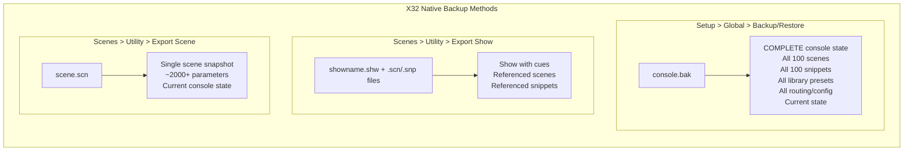
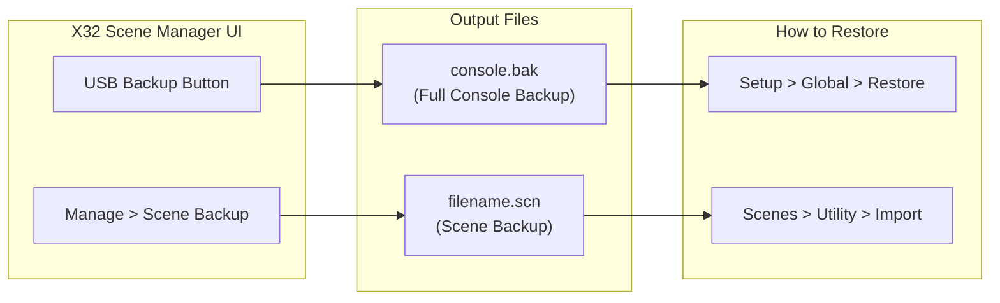
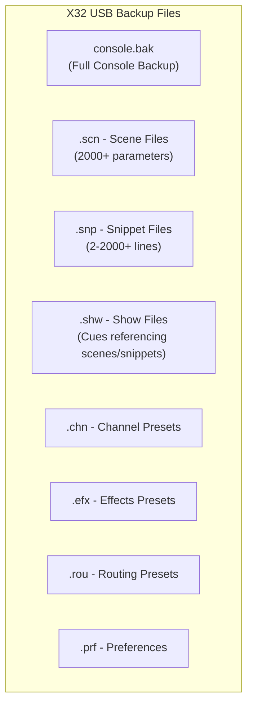
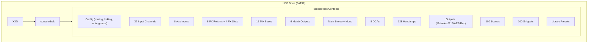
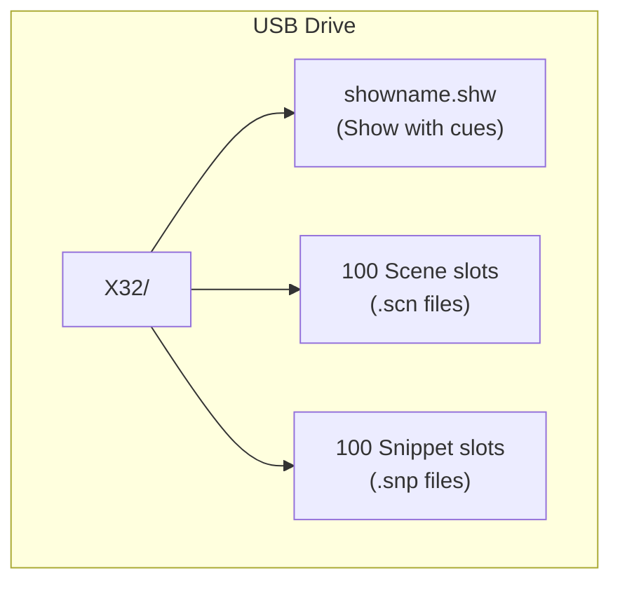

# X32 USB Backup Structure

## Overview

The Behringer X32 uses different backup methods with distinct purposes:



## Our Implementation



| Button | What It Creates | Contents | How to Restore on X32 |
|--------|-----------------|----------|----------------------|
| **USB Backup** | `console.bak` file | ALL scenes, snippets, presets, routing, current state | Setup > Global > Restore |
| **Scene Backup** | `.scn` scene file | Current console state as single scene (~2000+ params) | Scenes > Utility > Import |

## USB Drive Requirements

- Must be formatted as **FAT32**
- USB 2.0 drives recommended (USB 3.0 may have issues)
- Maximum 32GB capacity / 4GB file size limit

## console.bak File Structure

The `console.bak` file created by `Setup > Backup > Export` is an ASCII text file containing:

```mermaid
flowchart TB
    subgraph CONSOLEBAK["console.bak File Structure"]
        direction TB
        H["Header Line<br/>#firmware# version info"]

        subgraph CURRENT["Current Console State"]
            CFG["/-prefs/* (preferences)"]
            STAT["/-stat/* (status/state)"]
            CONFIG["config/* (linking, routing, mute groups)"]
            CH["ch/01-32/* (all 32 channels)"]
            AUX["auxin/01-08/* (8 aux inputs)"]
            FXRTN["fxrtn/01-08/* (8 FX returns)"]
            BUS["bus/01-16/* (16 mix buses)"]
            MTX["mtx/01-06/* (6 matrices)"]
            MAIN["main/st/* main/m/* (stereo + mono)"]
            DCA["dca/1-8/* (8 DCAs)"]
            FX["fx/1-8/* (8 FX slots)"]
            HA["headamp/000-127/* (128 headamps)"]
            OUT["outputs/* (all outputs)"]
        end

        subgraph SCENES["All 100 Scene Slots"]
            S1["/-show/showfile/scene/000/*"]
            S2["/-show/showfile/scene/001/*"]
            SN["... through scene/099/*"]
        end

        subgraph SNIPPETS["All 100 Snippet Slots"]
            SN1["/-show/showfile/snippet/000/*"]
            SN2["/-show/showfile/snippet/001/*"]
            SNX["... through snippet/099/*"]
        end

        subgraph LIBS["Library Presets"]
            CHAN["/-libs/ch/* (channel presets)"]
            EFX["/-libs/fx/* (FX presets)"]
            ROU["/-libs/r/* (routing presets)"]
        end
    end

    H --> CURRENT
    CURRENT --> SCENES
    SCENES --> SNIPPETS
    SNIPPETS --> LIBS
```



### Header Format
```
#4.06# "ConsoleName" firmware_version timestamp
```

### Data Sections (in order)
1. **Preferences** (`/-prefs/*`) - screen brightness, preferences
2. **Status** (`/-stat/*`) - current operational state
3. **Config** (`/config/*`) - channel linking, mute groups, routing tables
4. **Channels** (`/ch/01-32/*`) - all input channel settings
5. **Aux Inputs** (`/auxin/01-08/*`) - aux input settings
6. **FX Returns** (`/fxrtn/01-08/*`) - effects return settings
7. **Mix Buses** (`/bus/01-16/*`) - 16 mix bus settings
8. **Matrices** (`/mtx/01-06/*`) - 6 matrix settings
9. **Mains** (`/main/st/*`, `/main/m/*`) - stereo and mono mains
10. **DCAs** (`/dca/1-8/*`) - 8 DCA settings
11. **FX Slots** (`/fx/1-8/*`) - 8 effects processor settings
12. **Headamps** (`/headamp/000-127/*`) - 128 preamp settings
13. **Outputs** (`/outputs/*`) - all physical output routing
14. **Scenes** (`/-show/showfile/scene/000-099/*`) - all 100 scene slots
15. **Snippets** (`/-show/showfile/snippet/000-099/*`) - all 100 snippet slots
16. **Libraries** (`/-libs/*`) - channel, FX, and routing presets

## File Types



## Full Console Backup (Setup > Backup)



## Show Export (Scenes > Utility > Export Show)



## Scene File Format (.scn)

ASCII text file with ~2000+ lines:

```
#firmware# "SceneName" "Notes" %safetymask hasaliases
/ch/01/config "Ch1Name" 1 GN 1
/ch/01/preamp +0.00 ON 0 105
/ch/01/gate ON EXP2 -42.0 20.0 10 200 0
/ch/01/dyn ON COMP RMS LIN -35.0 2.0 0 10.0 150 0 0.00 OFF 100
/ch/01/eq ON
/ch/01/eq/1 PEQ 100.0 2.0 0.00
...
/dca/1/on 1
/dca/1/fader 0.41
...
```

## Parameter Categories in Scene/Backup

| Section | Count | Description |
|---------|-------|-------------|
| config/* | ~50 | Channel linking, mute groups, routing |
| ch/01-32/* | ~800 | 32 input channels (config, preamp, gate, dyn, eq, mix, grp) |
| auxin/01-08/* | ~200 | 8 aux inputs |
| fxrtn/01-08/* | ~200 | 8 FX returns |
| bus/01-16/* | ~400 | 16 mix buses |
| mtx/01-06/* | ~150 | 6 matrix outputs |
| main/st/* | ~50 | Main stereo bus |
| main/m/* | ~50 | Main mono bus |
| dca/1-8/* | ~20 | 8 DCAs |
| fx/1-4/* | ~100 | 4 FX slots |
| headamp/000-127/* | ~128 | 128 headamp presets |
| outputs/* | ~50 | All physical outputs |

**Total: ~2000+ parameters**

## Implementation Notes

For our backup utility:

1. **Quick Scene Backup** (.scn):
   - Single scene file with current console state
   - Can be imported via Scenes > Utility > Import Scene
   - Good for: saving current mix state

2. **Full Console Backup** (console.bak):
   - Complete backup matching X32's Setup > Backup
   - Includes all 100 scenes, 100 snippets, all presets
   - Good for: complete console restoration

## References

- [Drew Brashler - X32 Snippets, Scenes, and Cues](https://drewbrashler.com/2016/behringer-x32-snippets-scenes-cues/)
- [Survive The Gig - X32 USB Setup](https://survivethegig.com/x32-setting-up-a-usb-drive-for-the-x32/)
- [Patrick-Gilles Maillot's X32 Utilities](https://github.com/pmaillot/X32-Behringer)
- [Unofficial X32 OSC Protocol](https://sites.google.com/site/patrickmaillot/x32)
