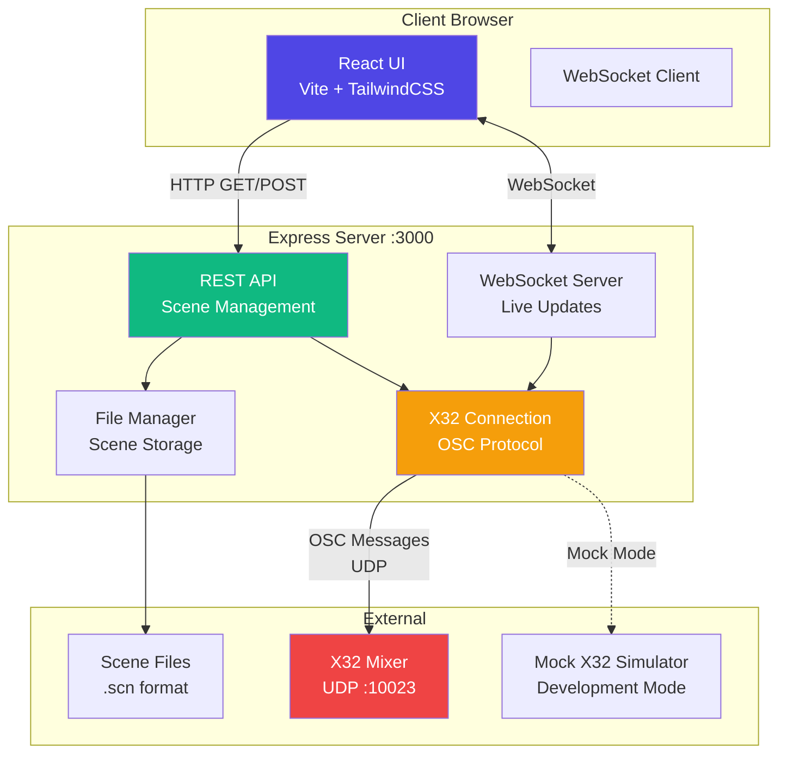
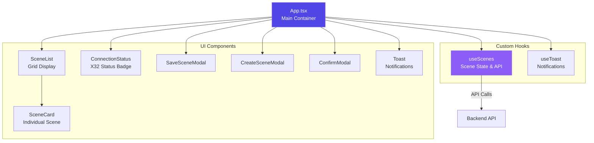
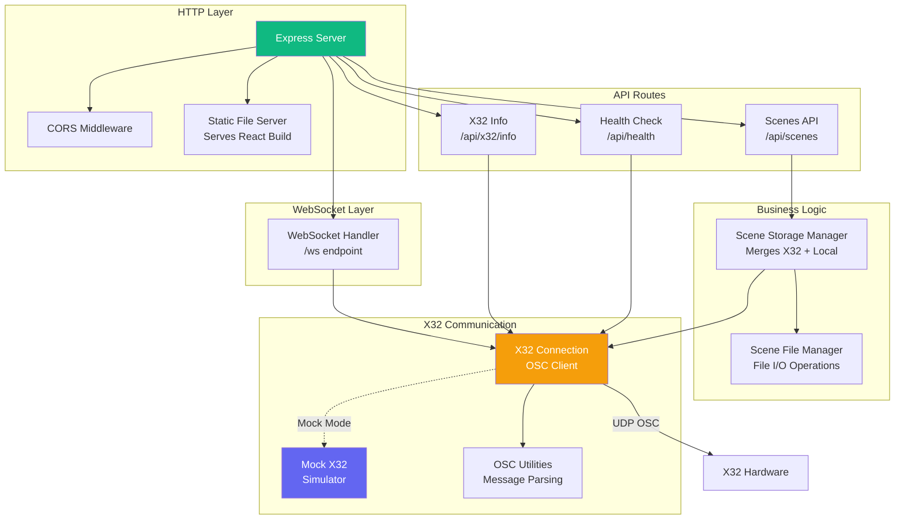
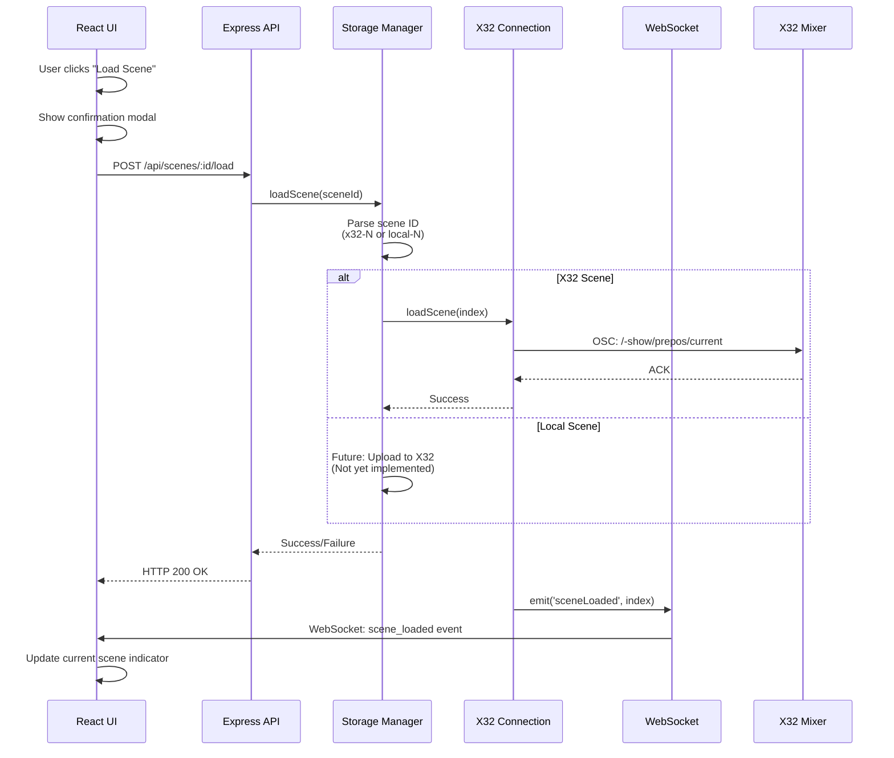
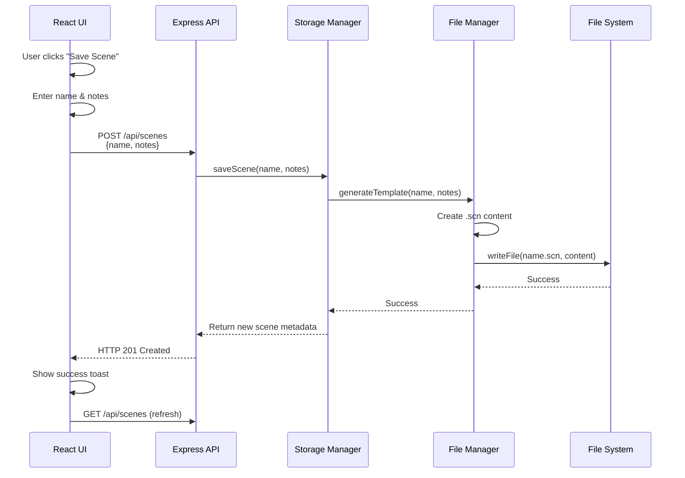
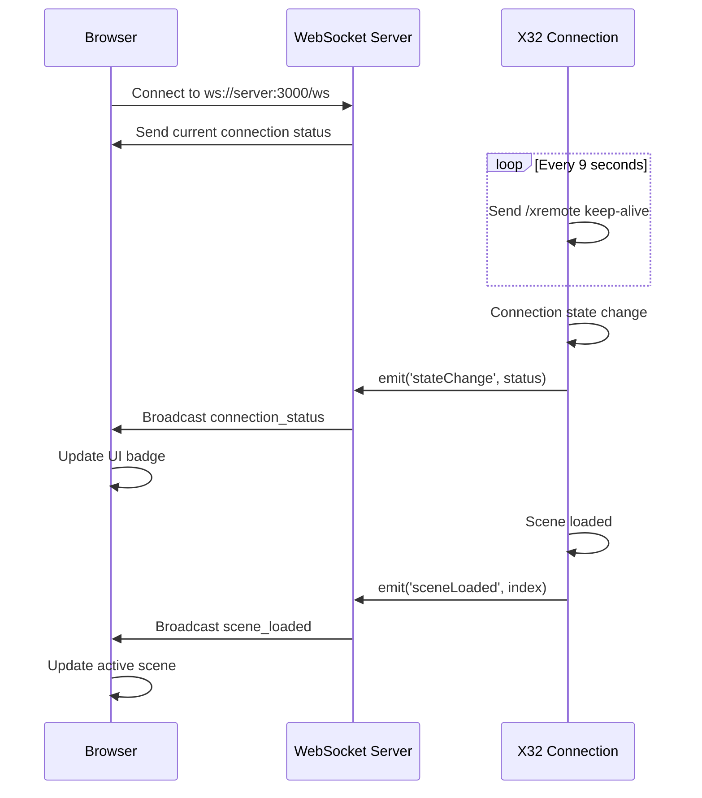
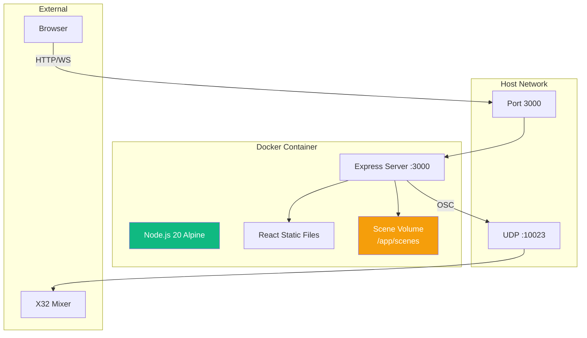

# Architecture Documentation

## X32 Scene Manager - System Architecture

**Version:** 1.0.0
**Last Updated:** 2025-12-07
**Status:** Production Ready

---

## Overview

X32 Scene Manager is a full-stack web application for managing Behringer X32 mixer scenes. The system enables real-time scene management, local backups, and WebSocket-based live updates, with development support through a mock X32 simulator.

**Key Capabilities:**
- Load/save mixer scenes to X32 internal memory (100 slots)
- Create local .scn file backups for scene preservation
- Real-time connection status via WebSocket
- Mock mode for development without hardware
- Docker deployment for Unraid/homelab environments

---

## System Architecture

### High-Level Architecture



---

## Component Architecture

### Frontend Components (React 19)



**Component Hierarchy:**
```
App (Root)
├── ConnectionStatus (Header)
├── SceneList
│   └── SceneCard[] (Multiple)
├── SaveSceneModal
├── CreateSceneModal
├── ConfirmModal (Load/Delete)
└── ToastContainer
    └── Toast[] (Multiple)
```

---

### Backend Services (Express 5 + Node.js 20)



---

## Data Flow

### Scene Loading Flow



### Scene Backup Flow



### WebSocket Connection Flow



---

## File Structure

```
x32-ui/
├── src/                          # Frontend source (React + TypeScript)
│   ├── main.tsx                  # Application entry point
│   ├── App.tsx                   # Root component
│   ├── components/               # React components
│   │   ├── ConnectionStatus.tsx  # X32 connection badge
│   │   ├── SceneList.tsx         # Scene grid container
│   │   ├── SceneCard.tsx         # Individual scene card
│   │   ├── SaveSceneModal.tsx    # Save scene dialog
│   │   ├── CreateSceneModal.tsx  # Create scene dialog
│   │   ├── ConfirmModal.tsx      # Generic confirmation
│   │   ├── Modal.tsx             # Base modal component
│   │   └── Toast.tsx             # Notification system
│   ├── hooks/                    # Custom React hooks
│   │   └── useScenes.ts          # Scene management logic
│   ├── types/                    # TypeScript type definitions
│   │   └── scene.ts              # Scene & API types
│   └── styles/                   # Styling
│       └── globals.css           # Tailwind base styles
│
├── server/                       # Backend source (Express + TypeScript)
│   ├── index.ts                  # Server entry point
│   ├── api/                      # REST API routes
│   │   └── scenes.ts             # Scene CRUD endpoints
│   ├── websocket/                # WebSocket layer
│   │   └── handler.ts            # WS connection manager
│   ├── x32/                      # X32 communication
│   │   ├── connection.ts         # OSC client connection
│   │   ├── mock-x32.ts           # Development simulator
│   │   ├── osc-utils.ts          # OSC message helpers
│   │   ├── scene-parser.ts       # .scn file parser
│   │   └── types.ts              # X32 type definitions
│   ├── storage/                  # File storage
│   │   └── file-manager.ts       # Scene storage manager
│   └── types/                    # Type definitions
│       └── osc.d.ts              # OSC library types
│
├── dist/                         # Frontend build output (Vite)
├── dist-server/                  # Backend build output (tsc)
├── scenes/                       # Scene file storage (.scn files)
├── docs/                         # Documentation
│   ├── architecture.md           # This file
│   ├── tech-stack.md             # Technology decisions
│   ├── api-spec.yaml             # OpenAPI specification
│   └── db-schema.sql             # Data schema documentation
│
├── docker-compose.yml            # Docker orchestration
├── Dockerfile                    # Multi-stage build
├── package.json                  # Dependencies & scripts
├── vite.config.ts                # Vite configuration
├── tsconfig.json                 # TypeScript (frontend)
└── server/tsconfig.json          # TypeScript (backend)
```

---

## State Management Strategy

### Frontend State Architecture

**React 19 with Built-in Hooks (No Redux)**

The application uses a lightweight state management approach:

1. **Local Component State** (`useState`)
   - Modal visibility
   - Form inputs
   - UI interactions (loading, errors)

2. **Custom Hooks** (`useScenes`, `useToast`)
   - Encapsulate business logic
   - Manage API communication
   - Handle WebSocket subscriptions
   - Provide clean interface to components

3. **No Global State Library Needed**
   - Small application scope
   - Most state is server-driven
   - React 19's concurrent features handle updates efficiently

**State Flow:**
```
Server (Source of Truth)
    ↓
useScenes Hook (API Layer)
    ↓
App Component (State Distribution)
    ↓
Child Components (Consumption)
```

### Backend State Management

**Singleton Pattern for Shared Resources:**

1. **X32 Connection** (`x32Connection`)
   - Single OSC UDP connection
   - Event emitter for state changes
   - Shared across all requests

2. **WebSocket Handler** (`wsHandler`)
   - Single WebSocket server instance
   - Client connection pool
   - Broadcast capabilities

3. **Scene Storage Manager**
   - Per-request instances
   - Factory function pattern
   - Stateless operations

**Why Singletons?**
- OSC protocol requires single UDP port
- WebSocket server is inherently singular
- Prevents connection pool exhaustion
- Simplified event subscription model

---

## Key Design Decisions

### 1. Monolithic Architecture

**Decision:** Single Express server serves both frontend and API.

**Rationale:**
- Simpler deployment (single Docker container)
- No CORS complexity in production
- Reduced infrastructure overhead
- Sufficient for expected scale (single X32 mixer)

**Trade-off:**
- Frontend and backend scale together (acceptable for use case)

### 2. Mock Mode for Development

**Decision:** Built-in X32 simulator for development without hardware.

**Rationale:**
- Enables rapid development without mixer access
- Facilitates testing and CI/CD
- Reduces hardware dependency for contributors
- Same codebase for mock and real modes

**Implementation:**
- Toggle via `MOCK_MODE` environment variable
- Mock responds to all OSC commands
- Simulates realistic latency and responses

### 3. Hybrid Scene Storage (X32 + Local)

**Decision:** Merge X32 internal scenes with local .scn file backups.

**Rationale:**
- X32 internal memory is volatile (lost on factory reset)
- Local backups provide disaster recovery
- Allows scene management when mixer is offline
- Users can archive unlimited scenes locally

**Data Model:**
- `source: 'x32'` - Only in mixer memory
- `source: 'local'` - Only on disk
- `source: 'both'` - Synchronized copy

### 4. WebSocket for Live Updates

**Decision:** WebSocket alongside REST API.

**Rationale:**
- Real-time connection status updates
- Notify all clients when scenes change
- Better UX than polling
- Minimal overhead (single connection per client)

**Why Not SSE?**
- WebSocket provides bidirectional communication
- Better browser support in modern environments
- More flexible for future features (remote control)

### 5. File-Based Scene Storage (Not Database)

**Decision:** Store scenes as .scn files instead of SQL/NoSQL database.

**Rationale:**
- .scn is X32's native format
- Direct compatibility with X32 Edit software
- Easy manual backup/transfer (just copy files)
- No database deployment complexity
- Sufficient performance for expected scale (<1000 scenes)

**Trade-off:**
- No advanced querying (acceptable - simple list operations)
- File locking considerations (mitigated by low concurrency)

---

## Security Considerations

### Network Security

1. **No Authentication** (Current Design)
   - Assumes trusted local network
   - X32 protocol has no auth
   - Typical deployment: homelab/church LAN

2. **Future Enhancement: Basic Auth**
   - Planned for internet-exposed deployments
   - Environment variable for password
   - JWT tokens for API access

### Input Validation

1. **Scene Names**
   - Sanitized to prevent directory traversal
   - Max length enforcement
   - Invalid character filtering

2. **API Request Validation**
   - Type checking via TypeScript
   - Required field validation
   - Error handling for malformed requests

### Docker Security

1. **Non-Root User**
   - Runs as `nodejs` user (UID 1001)
   - Minimal privileges

2. **Multi-Stage Build**
   - Production image excludes dev dependencies
   - Smaller attack surface

---

## Scalability & Performance

### Expected Scale
- **Concurrent Users:** 1-5 (typical church/venue)
- **Scene Count:** 50-200
- **Request Rate:** <10 req/min (manual operations)

### Performance Characteristics

| Operation | Expected Latency | Notes |
|-----------|-----------------|-------|
| Load Scene List | <200ms | File I/O + OSC queries |
| Load Scene to X32 | <500ms | OSC round-trip |
| Save Scene to Disk | <100ms | File write operation |
| WebSocket Message | <50ms | In-memory broadcast |

### Bottlenecks

1. **X32 OSC Communication**
   - Serial OSC messages (not parallel)
   - 5-second timeout per request
   - Mitigated by mock mode for bulk testing

2. **File System I/O**
   - Not a concern at expected scale
   - Linux file cache handles reads
   - Async I/O prevents blocking

---

## Error Handling Strategy

### Frontend Error Handling

1. **User-Facing Errors**
   - Toast notifications for all operations
   - Clear, actionable error messages
   - Automatic dismissal after 5 seconds

2. **Network Errors**
   - Retry logic for transient failures
   - Connection status indicator
   - Graceful degradation (show cached scenes)

### Backend Error Handling

1. **API Error Responses**
   ```typescript
   {
     success: false,
     error: "Human-readable message"
   }
   ```

2. **Logging Strategy**
   - Console logging for development
   - Structured logs for production (JSON)
   - Error stack traces in development mode

3. **Graceful Degradation**
   - X32 connection failure → Continue with local scenes
   - File system errors → Return empty list
   - WebSocket disconnect → Auto-reconnect

---

## Deployment Architecture

### Docker Deployment



**Network Mode:** `host` (required for UDP broadcast discovery)
**Persistent Volume:** `x32-scenes:/app/scenes`
**Health Check:** `wget http://localhost:3000/api/health`

### Environment Variables

| Variable | Default | Description |
|----------|---------|-------------|
| `PORT` | `3000` | HTTP server port |
| `X32_IP` | `192.168.0.64` | X32 IP address |
| `X32_PORT` | `10023` | X32 OSC port |
| `MOCK_MODE` | `false` | Enable mock X32 |
| `SCENE_DIR` | `/app/scenes` | Scene file directory |

---

## Future Architecture Considerations

### Planned Enhancements

1. **Full Scene Capture**
   - Currently: Template placeholder
   - Future: Capture complete X32 state via OSC queries
   - Requires 2000+ OSC commands per scene

2. **Scene Upload (Local → X32)**
   - Currently: One-way sync (X32 → Local)
   - Future: Upload .scn files to X32 memory
   - Requires parsing and sending all OSC parameters

3. **Multi-User Collaboration**
   - WebSocket scene lock mechanism
   - User presence indicators
   - Conflict resolution for simultaneous edits

4. **Scene Versioning**
   - Git-like version history for scenes
   - Diff viewer for changes
   - Rollback capabilities

5. **Cloud Backup Integration**
   - S3-compatible storage sync
   - Automatic backups on schedule
   - Disaster recovery workflow

---

## Technology Constraints

### X32 OSC Protocol Limitations

1. **No Transaction Support**
   - Cannot atomically load multiple parameters
   - Scene loads are "all or nothing" at X32 level

2. **No Scene Upload API**
   - X32 doesn't expose a "load scene from OSC" command
   - Must send individual parameter updates
   - Time-consuming for full scene restore

3. **Keep-Alive Requirement**
   - Must send `/xremote` every 10 seconds
   - Connection dies if missed
   - Handled automatically by connection manager

### Browser Compatibility

- **Target:** Modern browsers (Chrome 90+, Firefox 88+, Safari 14+)
- **React 19 Features:** Used (Concurrent Mode, Automatic Batching)
- **WebSocket:** Universally supported in target browsers

---

## Maintenance & Monitoring

### Health Monitoring

**Endpoint:** `GET /api/health`

Response:
```json
{
  "status": "ok",
  "x32Connection": "connected",
  "mockMode": false,
  "timestamp": "2025-12-07T10:30:00Z"
}
```

### Logging Points

1. **Server Startup**
   - Configuration summary
   - X32 connection status
   - Listening address

2. **X32 Operations**
   - All OSC messages (debug level)
   - Connection state changes
   - Scene load/save operations

3. **API Requests**
   - Endpoint access (info level)
   - Error responses (error level)

---

## Conclusion

The X32 Scene Manager architecture prioritizes simplicity and reliability for small-scale deployments. The monolithic design reduces operational complexity while maintaining clear separation of concerns through modular code organization.

Key strengths:
- Production-ready Docker deployment
- Mock mode enables efficient development
- WebSocket provides responsive UX
- File-based storage ensures compatibility

The architecture supports the current use case effectively while providing clear paths for future enhancements as requirements evolve.
