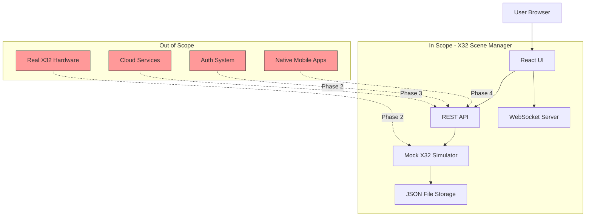

# Project Scope Definition

## Executive Summary

The X32 Scene Manager is a **web-based scene management interface** for Behringer X32 digital mixers, designed specifically for volunteer training environments. This MVP (Minimum Viable Product) focuses on delivering a **mock-only simulation** that allows users to practice scene management workflows without requiring physical X32 hardware.

**Project Goal**: Enable volunteers to confidently load, save, and manage mixer scenes through an intuitive touch-friendly interface.

**Timeline**: 2-4 weeks for MVP completion
**Team Size**: 1 developer
**Deployment Target**: Docker container on Unraid server

---

## In Scope

### 1. Core Scene Management Features

#### Scene Operations
- **View Scene List**: Display all available scenes with details (number, name, last modified)
- **Load Scene**: Apply a scene to the (mock) mixer with confirmation
- **Save Scene**: Persist current mixer state to a scene slot with overwrite protection
- **Create Scene**: Add new scene with user-defined name and number
- **Delete Scene**: Remove scenes with confirmation dialog
- **Currently Loaded Indicator**: Visual feedback showing which scene is active

#### User Interface
- **React-based SPA**: Single-page application built with React 19
- **Touch-Optimized**: Large touch targets (44x44px minimum), no hover dependencies
- **Responsive Design**: Works on desktop, tablet, and mobile devices
- **Real-time Updates**: WebSocket-driven UI updates when scenes change
- **Loading States**: Clear visual feedback during operations
- **Error Handling**: User-friendly error messages with recovery suggestions

#### Search and Filter
- **Scene Search**: Filter scene list by name/number
- **Real-time Filtering**: Update results as user types
- **Result Count**: Display number of matching scenes
- **Search Highlight**: Highlight matching text in results

---

### 2. Mock X32 Simulator

#### Simulation Features
- **OSC Protocol Mock**: Simulate X32 OSC command/response patterns
- **Scene State Management**: Maintain virtual mixer state in memory
- **Realistic Timing**: Introduce appropriate delays (100-500ms) to mimic hardware
- **Scene Storage**: Persist scenes to JSON files on filesystem
- **WebSocket Events**: Broadcast scene changes to all connected clients
- **Debug Mode**: Optional logging of OSC messages for development

#### Supported OSC Commands (Mock)
- `/scene/load` - Load scene by number
- `/scene/save` - Save current state to scene
- `/scene/name` - Get/set scene name
- `/scene/current` - Query currently loaded scene
- Custom commands for scene CRUD operations

---

### 3. Backend API

#### RESTful Endpoints
```
GET    /api/scenes          - List all scenes
GET    /api/scenes/:id      - Get scene details
POST   /api/scenes          - Create new scene
PUT    /api/scenes/:id      - Update existing scene
DELETE /api/scenes/:id      - Delete scene
POST   /api/scenes/:id/load - Load scene to mixer
GET    /api/status          - Get current mixer status
```

#### WebSocket Events
```
scene:loaded      - Scene was loaded
scene:created     - New scene created
scene:updated     - Scene modified
scene:deleted     - Scene removed
mixer:connected   - Mock mixer connected
mixer:disconnected - Mock mixer disconnected
```

#### Data Storage
- **File-based JSON**: Scenes stored in `/app/scenes` directory
- **Scene Format**: Standardized JSON schema with metadata
- **Atomic Writes**: Ensure data integrity during saves
- **Backup**: Scene directory mounted as Docker volume for persistence

---

### 4. Docker Deployment

#### Container Specifications
- **Base Image**: Node.js 22-alpine
- **Multi-stage Build**: Separate build and runtime layers
- **Size Target**: < 200MB compressed
- **Non-root User**: Run as `node` user for security
- **Single Container**: Frontend and backend bundled together

#### Configuration
- **Environment Variables**: Port, log level, storage path
- **Volume Mounts**: `/app/scenes` for persistent storage
- **Port Mapping**: Default port 3000 (configurable)
- **Health Check**: `/api/health` endpoint for monitoring
- **Graceful Shutdown**: Handle SIGTERM for clean stops

#### Unraid Integration
- **Community App Template**: Provide Unraid template XML
- **Documentation**: Step-by-step deployment guide
- **Default Settings**: Sensible defaults for typical setup

---

### 5. Development Infrastructure

#### Build System
- **Vite**: Frontend build tool with HMR
- **TypeScript**: Strict mode enabled for type safety
- **TSX**: Development server for backend with hot reload
- **Docker Build**: Optimized multi-stage Dockerfile

#### Code Organization
```
src/
├── components/        - React UI components
├── hooks/            - Custom React hooks
├── types/            - TypeScript type definitions
└── styles/           - Global styles, Tailwind config

server/
├── api/              - REST endpoint handlers
├── websocket/        - WebSocket server logic
├── x32/              - Mock X32 simulator
├── storage/          - File-based storage layer
└── types/            - Backend type definitions
```

#### Type Safety
- **Shared Types**: Common types between frontend/backend
- **API Contracts**: Typed request/response interfaces
- **Scene Schema**: Validated scene data structure
- **OSC Types**: Type definitions for X32 OSC messages

---

### 6. Documentation

#### User Documentation
- **User Guide**: How to use the scene manager (with screenshots)
- **Quick Start**: Get started in 5 minutes
- **Troubleshooting**: Common issues and solutions

#### Developer Documentation
- **API Specification**: OpenAPI 3.0 YAML documentation
- **Setup Guide**: Local development environment setup
- **Architecture Overview**: System design and component interaction
- **Database Schema**: Scene data structure documentation

#### Operations Documentation
- **Deployment Guide**: Docker installation on Unraid
- **Configuration Reference**: All environment variables
- **Backup/Restore**: How to backup scene data
- **Monitoring**: Health checks and log interpretation

---

## Out of Scope

### Explicitly Excluded from MVP (Phase 1)

#### 1. Live X32 Hardware Communication
- **No real OSC communication** with physical X32 mixers
- **No network discovery** of X32 devices
- **No parameter synchronization** from hardware
- **No offline/online mode switching**
- **Rationale**: Focus on UI/UX and training workflows first; hardware integration adds significant complexity

#### 2. Mixing Controls
- **No channel faders** or gain controls
- **No EQ interfaces** (parametric, graphic)
- **No effects controls** (reverb, delay, compressor, etc.)
- **No routing configuration** (inputs, outputs, buses)
- **No metering** (level meters, RTA, spectrum)
- **No configuration pages** (inputs, outputs, DCA, mute groups)
- **Rationale**: Scene manager is for scene selection only, not mixing

#### 3. Authentication and Authorization
- **No user login/logout**
- **No password protection**
- **No role-based access control** (admin vs. operator)
- **No user management**
- **No audit logging** of user actions
- **Rationale**: Single-user trusted environment; auth adds complexity without immediate value

#### 4. Advanced Scene Features
- **No scene version history** or revision tracking
- **No scene diff viewer** (compare two scenes)
- **No scene templates** or starter packs
- **No scene categories/folders** organization
- **No scene scheduling** or automation
- **No scene partial loading** (load only channels 1-8, etc.)
- **Rationale**: Nice-to-have features for Phase 2+

#### 5. Multi-User Collaboration
- **No concurrent editing** conflict resolution
- **No user presence indicators** (who's viewing)
- **No scene locking** during edits
- **No chat or comments** on scenes
- **No scene sharing** between users
- **Rationale**: Single-operator workflow assumption

#### 6. Cloud Features
- **No cloud sync** between devices
- **No remote access** from internet
- **No centralized scene library**
- **No analytics or telemetry**
- **Rationale**: Local network deployment only

#### 7. Mobile Native Apps
- **No iOS native app**
- **No Android native app**
- **No offline mobile support**
- **Rationale**: Web app sufficient; native apps are separate projects

#### 8. Advanced UI Features
- **No drag-and-drop** scene reordering
- **No bulk operations** (multi-select, batch delete)
- **No keyboard shortcuts**
- **No customizable themes** or dark mode
- **No accessibility features** (screen reader, WCAG compliance)
- **Rationale**: MVP focuses on core workflows; enhancements later

#### 9. Testing Infrastructure
- **No automated unit tests** (initial MVP)
- **No integration tests**
- **No E2E tests**
- **No CI/CD pipeline**
- **No automated deployment**
- **Rationale**: Manual testing sufficient for MVP; automation in Phase 2

#### 10. Advanced Data Management
- **No scene export/import** (individual or bulk)
- **No scene backup/restore UI**
- **No scene duplication**
- **No scene metadata** (tags, notes, categories)
- **Rationale**: Basic CRUD sufficient for MVP

---

## Boundaries and Interfaces

### System Boundaries



### External Dependencies

**In Scope Dependencies**:
- Docker runtime (deployment platform)
- Modern web browsers (Chrome, Safari, Firefox, Edge)
- Unraid server OS (deployment target)
- NPM registry (for package installation)

**Out of Scope Dependencies**:
- X32 hardware (Phase 2)
- Cloud hosting platforms (Phase 3)
- Authentication providers (OAuth, SAML, etc.)
- Database systems (PostgreSQL, MongoDB, etc.)

---

## Acceptance Criteria for Scope Completion

The project scope will be considered **complete** when:

### Functional Completeness
1. All 5 core scene operations work end-to-end (list, load, save, create, delete)
2. Search/filter returns accurate results
3. WebSocket real-time updates work with multiple browser tabs
4. Mock X32 simulator responds to all defined OSC commands
5. Scene data persists across Docker container restarts

### Technical Completeness
6. Docker container builds successfully and runs on Unraid
7. Application serves frontend and backend from single container
8. Health check endpoint returns correct status
9. All API endpoints documented in OpenAPI spec
10. TypeScript compiles without errors in strict mode

### Quality Completeness
11. UI is touch-friendly on tablet devices (manually verified)
12. Error handling prevents crashes and shows user-friendly messages
13. No data loss during normal operations
14. Application runs stable for 8+ continuous hours

### Documentation Completeness
15. User guide covers all scene operations
16. Deployment guide enables Unraid installation
17. API documentation matches implementation
18. Developer setup guide enables local development

---

## Scope Change Control

### Change Request Process

Any additions to the in-scope features must:

1. **Be documented**: Written justification with impact analysis
2. **Be prioritized**: Compared against existing scope for importance
3. **Include timeline impact**: Estimate of delay to MVP delivery
4. **Be approved**: Stakeholder sign-off required

### Automatic Scope Increases

The following changes are **automatically approved** without process:

- Bug fixes for in-scope features
- Performance optimizations
- Security patches
- Accessibility improvements (within reason)
- Documentation clarifications

### Automatic Scope Exclusions

The following are **automatically rejected** for MVP:

- Features requiring new external services
- Features requiring >3 days of development
- Features requiring database migration
- Features requiring breaking API changes
- Features duplicating existing functionality

---

## Phase Planning

### Phase 1: MVP (Current Scope) - Weeks 1-4
**Goal**: Deliver functional scene manager with mock X32
**Deliverables**: Working application, Docker image, documentation

### Phase 2: Live X32 Integration - Weeks 5-8
**Goal**: Connect to real X32 hardware via OSC
**New Scope**:
- Real OSC communication over UDP
- X32 network discovery
- Connection status management
- Offline mode fallback
- Parameter synchronization

### Phase 3: Enhanced Features - Weeks 9-12
**Goal**: Add advanced scene management capabilities
**New Scope**:
- Scene export/import
- Scene version history
- Scene templates
- User authentication
- Audit logging

### Phase 4: Multi-Venue Support - Weeks 13-16
**Goal**: Support multiple venues/locations
**New Scope**:
- Multi-tenant architecture
- Cloud sync
- Centralized scene library
- Usage analytics

---

## Risk Factors Affecting Scope

### High Risk (Likely to Impact Scope)

1. **X32 Protocol Complexity**: Mock may not accurately represent real hardware
   - **Mitigation**: Reference official X32 OSC documentation closely

2. **Docker on Unraid Issues**: Platform-specific deployment problems
   - **Mitigation**: Test on actual Unraid early in development

### Medium Risk

3. **WebSocket Scalability**: Performance issues with multiple clients
   - **Mitigation**: Limit to 10 concurrent connections in MVP

4. **File Storage Limitations**: JSON files may not scale beyond 100 scenes
   - **Mitigation**: Acceptable for MVP; plan DB migration for Phase 2

### Low Risk

5. **Browser Compatibility**: Older browsers not supporting ES2022 features
   - **Mitigation**: Target modern browsers only; document requirements

---

## Success Metrics

### Delivery Metrics
- **On-time Delivery**: MVP completed within 4 weeks
- **Scope Adherence**: All in-scope features implemented, no out-of-scope features added
- **Quality**: No critical bugs in production after 1 week of use

### User Metrics
- **Usability**: 80% of volunteer users can complete scene operations without help
- **Performance**: 95% of operations complete in < 1 second
- **Reliability**: Application uptime > 99% over first month

### Technical Metrics
- **Code Quality**: TypeScript strict mode with zero errors
- **Documentation**: 100% of API endpoints documented
- **Container Size**: Docker image < 200MB

---

## Appendix: Stakeholder Sign-off

| Role          | Name      | Approval Date | Signature |
|---------------|-----------|---------------|-----------|
| Product Owner |           |               |           |
| Developer     | Architect | 2025-12-07    | Approved  |
| User Rep      |           |               |           |

---

## Revision History

| Version | Date       | Author    | Changes                                  |
|---------|------------|-----------|------------------------------------------|
| 1.0     | 2025-12-07 | Architect | Initial scope definition                 |
