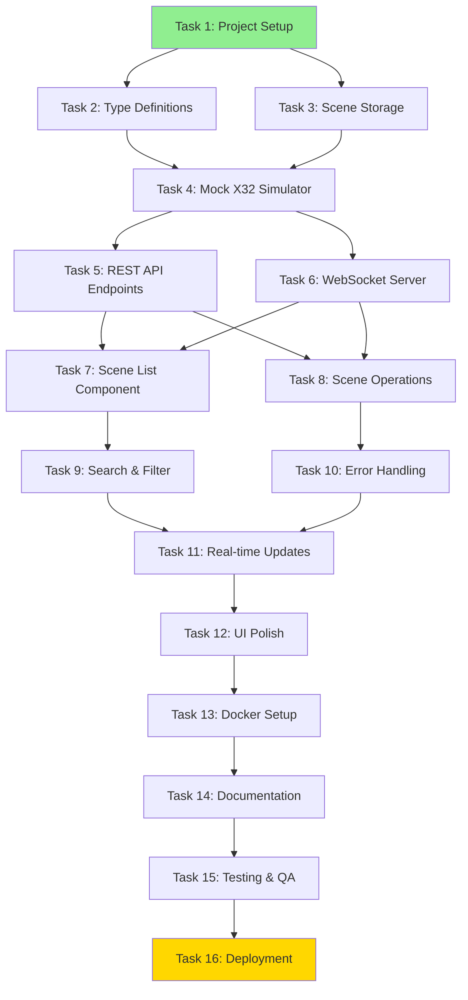

# Task Breakdown and Implementation Plan

## Overview

This document breaks down the X32 Scene Manager MVP into actionable development tasks. Tasks are organized by category, prioritized, and sized for complexity. Each task includes acceptance criteria and dependencies to guide implementation.

**Complexity Sizing**:
- **S (Small)**: 1-2 hours
- **M (Medium)**: 3-6 hours
- **L (Large)**: 1-2 days
- **XL (Extra Large)**: 3-5 days

---

## Task Dependency Graph



---

## Category 1: Foundation Tasks

### Task 1: Project Setup and Configuration
**Priority**: CRITICAL
**Complexity**: M
**Estimated Time**: 4 hours
**Dependencies**: None
**Assignee**: Developer

**Description**:
Set up the development environment with proper tooling, linting, and project structure. Ensure all dependencies are installed and build scripts work correctly.

**Acceptance Criteria**:
- [ ] TypeScript configured with strict mode enabled
- [ ] Vite config optimized for React development
- [ ] Tailwind CSS configured and working
- [ ] ESLint and Prettier configured (optional but recommended)
- [ ] Git repository initialized with .gitignore
- [ ] NPM scripts tested: `dev`, `dev:server`, `build`, `build:server`
- [ ] Hot module replacement (HMR) working for both frontend and backend
- [ ] README.md updated with setup instructions

**Implementation Notes**:
- Review existing `tsconfig.json` for strict mode settings
- Ensure Tailwind v4 is properly configured
- Verify TypeScript path aliases if used

**Files to Modify**:
- `C:\home\repos\x32-ui\tsconfig.json`
- `C:\home\repos\x32-ui\vite.config.ts`
- `C:\home\repos\x32-ui\package.json`

---

### Task 2: Shared Type Definitions
**Priority**: CRITICAL
**Complexity**: M
**Estimated Time**: 3 hours
**Dependencies**: Task 1
**Assignee**: Developer

**Description**:
Define TypeScript interfaces and types for scenes, API requests/responses, WebSocket events, and X32 OSC messages. These types will be shared between frontend and backend.

**Acceptance Criteria**:
- [ ] `Scene` interface defined with all properties (id, number, name, data, metadata)
- [ ] `SceneListResponse`, `SceneDetailResponse` API types defined
- [ ] `WebSocketEvent` union type for all WS message types
- [ ] `OSCMessage` type for X32 protocol messages
- [ ] `MixerState` type for mock X32 internal state
- [ ] API error response types defined
- [ ] All types exported from central location
- [ ] JSDoc comments on all public types

**Implementation Notes**:
```typescript
// Example Scene interface
interface Scene {
  id: string;              // UUID
  number: number;          // 1-100
  name: string;            // Max 64 chars
  description?: string;    // Optional notes
  data: MixerState;        // Full mixer state
  createdAt: string;       // ISO timestamp
  updatedAt: string;       // ISO timestamp
}
```

**Files to Create**:
- `C:\home\repos\x32-ui\src\types\scene.ts`
- `C:\home\repos\x32-ui\src\types\api.ts`
- `C:\home\repos\x32-ui\server\types\osc.ts`
- `C:\home\repos\x32-ui\server\types\mixer.ts`

---

## Category 2: Backend Core Tasks

### Task 3: Scene Storage Layer
**Priority**: CRITICAL
**Complexity**: L
**Estimated Time**: 8 hours
**Dependencies**: Task 2
**Assignee**: Developer

**Description**:
Implement file-based JSON storage for scenes with atomic writes, read operations, and error handling. Create a storage abstraction that can be replaced with a database later.

**Acceptance Criteria**:
- [ ] `SceneStorage` class with CRUD methods
- [ ] `listScenes()` - Returns all scenes sorted by number
- [ ] `getScene(id)` - Returns single scene by ID
- [ ] `createScene(scene)` - Writes new scene to file
- [ ] `updateScene(id, scene)` - Updates existing scene
- [ ] `deleteScene(id)` - Removes scene file
- [ ] Atomic writes (temp file + rename pattern)
- [ ] File validation on read (catch corrupt JSON)
- [ ] Scene numbering validation (1-100, no duplicates)
- [ ] Error handling for filesystem issues
- [ ] Index file for fast listing (optional optimization)

**Implementation Notes**:
- Store each scene in `scenes/{sceneId}.json`
- Use `fs.promises` for async file operations
- Implement file locking if concurrent writes expected
- Consider scene index cache for performance

**Files to Create**:
- `C:\home\repos\x32-ui\server\storage\SceneStorage.ts`
- `C:\home\repos\x32-ui\server\storage\index.ts`

**Testing Checklist**:
- Create scene successfully
- Read existing scene
- Update scene preserves data
- Delete scene removes file
- Handle corrupt JSON gracefully
- Prevent duplicate scene numbers

---

### Task 4: Mock X32 Simulator
**Priority**: CRITICAL
**Complexity**: XL
**Estimated Time**: 12 hours
**Dependencies**: Task 2, Task 3
**Assignee**: Developer

**Description**:
Build a mock X32 mixer simulator that maintains internal state and responds to OSC commands. This simulates the X32 hardware behavior for development and training.

**Acceptance Criteria**:
- [ ] `MockX32` class maintaining virtual mixer state
- [ ] Handle `/scene/load [number]` command
- [ ] Handle `/scene/save [number] [name]` command
- [ ] Handle `/scene/name [number]` query
- [ ] Handle `/scene/current` query
- [ ] Respond with appropriate OSC response messages
- [ ] Introduce realistic delays (100-500ms)
- [ ] Emit events when state changes (for WebSocket broadcast)
- [ ] Initialize with default mixer state
- [ ] Debug mode to log all OSC messages
- [ ] Support scene number validation (1-100)

**Implementation Notes**:
- Use `osc` npm package for message encoding/decoding
- Don't implement full X32 state (only scene-relevant parameters)
- Consider EventEmitter pattern for state change notifications
- Reference X32 OSC specification document

**OSC Commands to Implement**:
```
/scene/load ,i [1-100]              -> Load scene
/scene/save ,is [number] [name]     -> Save scene
/scene/current ,                    -> Query current scene
/scene/name ,i [number]             -> Get scene name
```

**Files to Create**:
- `C:\home\repos\x32-ui\server\x32\MockX32.ts`
- `C:\home\repos\x32-ui\server\x32\oscProtocol.ts`
- `C:\home\repos\x32-ui\server\x32\mixerState.ts`
- `C:\home\repos\x32-ui\server\x32\index.ts`

**Testing Checklist**:
- Load scene updates internal state
- Save scene persists to storage
- Query current scene returns correct number
- Invalid scene number rejected
- State change events emitted correctly

---

### Task 5: REST API Endpoints
**Priority**: CRITICAL
**Complexity**: L
**Estimated Time**: 8 hours
**Dependencies**: Task 3, Task 4
**Assignee**: Developer

**Description**:
Implement RESTful API endpoints for scene CRUD operations using Express. Include request validation, error handling, and proper HTTP status codes.

**Acceptance Criteria**:
- [ ] `GET /api/scenes` - List all scenes
- [ ] `GET /api/scenes/:id` - Get scene by ID
- [ ] `POST /api/scenes` - Create new scene
- [ ] `PUT /api/scenes/:id` - Update scene
- [ ] `DELETE /api/scenes/:id` - Delete scene
- [ ] `POST /api/scenes/:id/load` - Load scene to mixer
- [ ] `GET /api/status` - Get mixer status
- [ ] `GET /api/health` - Health check endpoint
- [ ] Request validation (schema validation)
- [ ] Proper HTTP status codes (200, 201, 400, 404, 500)
- [ ] Error response format standardized
- [ ] CORS configured for frontend origin
- [ ] Rate limiting (10 req/sec per client)

**Implementation Notes**:
- Use Express middleware for validation
- Consider Zod for runtime type validation
- Return consistent error format: `{ error: string, code: string }`
- Include request/response examples in comments

**Files to Create**:
- `C:\home\repos\x32-ui\server\api\sceneRoutes.ts`
- `C:\home\repos\x32-ui\server\api\statusRoutes.ts`
- `C:\home\repos\x32-ui\server\api\middleware.ts`
- `C:\home\repos\x32-ui\server\api\index.ts`

**Example Response Formats**:
```typescript
// GET /api/scenes
{
  scenes: Scene[],
  count: number
}

// Error response
{
  error: "Scene not found",
  code: "SCENE_NOT_FOUND",
  details?: any
}
```

**Testing Checklist**:
- All endpoints return correct status codes
- Validation rejects invalid input
- Error responses follow standard format
- CORS allows frontend requests
- Rate limiting blocks excessive requests

---

### Task 6: WebSocket Server
**Priority**: HIGH
**Complexity**: L
**Estimated Time**: 6 hours
**Dependencies**: Task 4
**Assignee**: Developer

**Description**:
Set up WebSocket server for real-time bidirectional communication. Broadcast scene change events to all connected clients and handle client connections/disconnections.

**Acceptance Criteria**:
- [ ] WebSocket server running alongside Express
- [ ] Handle client connect/disconnect events
- [ ] Broadcast `scene:loaded` event when scene loaded
- [ ] Broadcast `scene:created` event when scene created
- [ ] Broadcast `scene:updated` event when scene updated
- [ ] Broadcast `scene:deleted` event when scene removed
- [ ] Send `mixer:connected` on client connection
- [ ] Track connected client count
- [ ] Handle JSON message parsing errors
- [ ] Automatic reconnection handling (client-side)
- [ ] Limit concurrent connections to 10

**Implementation Notes**:
- Use `ws` npm package (already in dependencies)
- Integrate with Express server using `server.on('upgrade')`
- Listen to MockX32 events and broadcast to clients
- Send initial state snapshot on connection

**WebSocket Event Format**:
```typescript
{
  type: 'scene:loaded' | 'scene:created' | 'scene:updated' | 'scene:deleted',
  payload: Scene | { sceneId: string },
  timestamp: string
}
```

**Files to Create**:
- `C:\home\repos\x32-ui\server\websocket\WebSocketServer.ts`
- `C:\home\repos\x32-ui\server\websocket\eventBroadcaster.ts`
- `C:\home\repos\x32-ui\server\websocket\index.ts`

**Testing Checklist**:
- Client can connect successfully
- Events broadcast to all clients
- Disconnected clients removed from pool
- JSON parsing errors don't crash server
- Connection limit enforced

---

## Category 3: Frontend Core Tasks

### Task 7: Scene List Component
**Priority**: CRITICAL
**Complexity**: L
**Estimated Time**: 8 hours
**Dependencies**: Task 5, Task 6
**Assignee**: Developer

**Description**:
Build the main scene list UI component displaying all scenes with their details. Implement touch-friendly design with proper spacing and visual hierarchy.

**Acceptance Criteria**:
- [ ] Display scene number, name, and last modified time
- [ ] Highlight currently loaded scene with distinct styling
- [ ] Touch targets minimum 44x44 pixels
- [ ] Responsive grid/list layout (desktop vs. mobile)
- [ ] Loading skeleton while fetching data
- [ ] Empty state message when no scenes
- [ ] Smooth scroll for long lists
- [ ] Accessible keyboard navigation
- [ ] Scene cards show action buttons (Load, Edit, Delete)
- [ ] Visual feedback on hover/press

**Implementation Notes**:
- Use Tailwind for styling
- Consider virtualization if scene count > 100 (optional)
- Use React.memo for performance
- Implement loading states with Suspense (optional)

**Files to Create**:
- `C:\home\repos\x32-ui\src\components\SceneList\SceneList.tsx`
- `C:\home\repos\x32-ui\src\components\SceneList\SceneCard.tsx`
- `C:\home\repos\x32-ui\src\components\SceneList\EmptyState.tsx`
- `C:\home\repos\x32-ui\src\components\SceneList\LoadingSkeleton.tsx`

**Design Specifications**:
- Scene card padding: 16px
- Touch target size: 48x48px
- Font size: Scene name 18px, metadata 14px
- Currently loaded scene: Blue border, light blue background
- Card spacing: 12px gap

**Testing Checklist**:
- Renders correctly with 0, 1, 10, 100 scenes
- Currently loaded scene highlighted
- Responsive on mobile and desktop
- Touch targets meet accessibility standards
- Loading state shows before data arrives

---

### Task 8: Scene Operations UI
**Priority**: CRITICAL
**Complexity**: L
**Estimated Time**: 10 hours
**Dependencies**: Task 7
**Assignee**: Developer

**Description**:
Implement UI for scene CRUD operations: load with confirmation, create with form, save/update, and delete with confirmation. Include modals/dialogs for user interaction.

**Acceptance Criteria**:
- [ ] **Load Scene**: Confirmation dialog before loading
- [ ] **Create Scene**: Modal form with scene number and name inputs
- [ ] **Save Scene**: Update existing scene with new name
- [ ] **Delete Scene**: Confirmation dialog with scene details
- [ ] Form validation (scene number 1-100, name max 64 chars)
- [ ] Loading indicators during API calls
- [ ] Success/error notifications (toast messages)
- [ ] Disable actions during loading
- [ ] Close modals on success
- [ ] Cancel buttons to abort operations
- [ ] Keyboard shortcuts (Enter to confirm, Esc to cancel)

**Implementation Notes**:
- Use controlled components for forms
- Consider headlessui or radix-ui for modals (or build custom)
- Implement toast notification system
- Handle API errors gracefully

**Files to Create**:
- `C:\home\repos\x32-ui\src\components\SceneOperations\LoadSceneDialog.tsx`
- `C:\home\repos\x32-ui\src\components\SceneOperations\CreateSceneModal.tsx`
- `C:\home\repos\x32-ui\src\components\SceneOperations\DeleteSceneDialog.tsx`
- `C:\home\repos\x32-ui\src\components\Toast\ToastManager.tsx`
- `C:\home\repos\x32-ui\src\hooks\useSceneOperations.ts`

**Form Validation Rules**:
```typescript
{
  sceneNumber: {
    min: 1,
    max: 100,
    required: true,
    integer: true
  },
  sceneName: {
    maxLength: 64,
    required: true,
    pattern: /^[a-zA-Z0-9 _-]+$/  // Alphanumeric, spaces, underscore, dash
  }
}
```

**Testing Checklist**:
- Load scene shows confirmation
- Create scene validates input
- Delete scene shows confirmation
- Notifications appear on success/error
- Forms clear after submission
- ESC key closes modals

---

### Task 9: Search and Filter Functionality
**Priority**: MEDIUM
**Complexity**: M
**Estimated Time**: 4 hours
**Dependencies**: Task 7
**Assignee**: Developer

**Description**:
Add search/filter capability to scene list with real-time filtering and result highlighting. Include clear search button and result count display.

**Acceptance Criteria**:
- [ ] Search input field at top of scene list
- [ ] Filter scenes by number or name (case-insensitive)
- [ ] Update results in real-time as user types
- [ ] Highlight matching text in results (optional)
- [ ] Display count: "Showing X of Y scenes"
- [ ] Clear search button (X icon)
- [ ] Empty state when no results match
- [ ] Search persists during session (not across page reload)
- [ ] Debounced search (300ms delay)

**Implementation Notes**:
- Use `useDeferredValue` or debounce hook for performance
- Filter client-side (no API call needed)
- Consider fuzzy matching for better UX (optional)

**Files to Create**:
- `C:\home\repos\x32-ui\src\components\Search\SearchBar.tsx`
- `C:\home\repos\x32-ui\src\components\Search\NoResults.tsx`
- `C:\home\repos\x32-ui\src\hooks\useSceneSearch.ts`

**Search Logic**:
```typescript
const filteredScenes = scenes.filter(scene =>
  scene.name.toLowerCase().includes(query.toLowerCase()) ||
  scene.number.toString().includes(query)
);
```

**Testing Checklist**:
- Search by scene name works
- Search by scene number works
- Clear button resets search
- Result count displays correctly
- Empty state shows when no matches
- Debouncing prevents excessive filtering

---

### Task 10: Error Handling and Loading States
**Priority**: HIGH
**Complexity**: M
**Estimated Time**: 5 hours
**Dependencies**: Task 7, Task 8
**Assignee**: Developer

**Description**:
Implement comprehensive error handling for API failures, network issues, and validation errors. Add loading states and user-friendly error messages throughout the application.

**Acceptance Criteria**:
- [ ] Global error boundary to catch React errors
- [ ] API error handling with retry logic
- [ ] Network offline detection
- [ ] Loading spinners during data fetch
- [ ] Skeleton loaders for scene list
- [ ] Error messages with actionable suggestions
- [ ] Retry buttons for failed operations
- [ ] Timeout handling for slow requests (10s timeout)
- [ ] Differentiate error types (network, validation, server)
- [ ] Log errors to console for debugging

**Implementation Notes**:
- Use React Error Boundary component
- Create custom API client with error handling
- Consider `react-query` for advanced state management (optional)

**Files to Create**:
- `C:\home\repos\x32-ui\src\components\ErrorBoundary.tsx`
- `C:\home\repos\x32-ui\src\components\ErrorMessage.tsx`
- `C:\home\repos\x32-ui\src\utils\apiClient.ts`
- `C:\home\repos\x32-ui\src\hooks\useApiError.ts`

**Error Message Examples**:
```
Network Error: Unable to connect to server. Check your connection and try again.
Validation Error: Scene name must be 1-64 characters.
Server Error: Something went wrong. Please try again later.
Not Found: Scene #42 does not exist.
```

**Testing Checklist**:
- Error boundary catches render errors
- Network errors show retry option
- API errors display user-friendly messages
- Loading states appear during operations
- Timeout errors handled gracefully

---

### Task 11: Real-time WebSocket Integration
**Priority**: HIGH
**Complexity**: M
**Estimated Time**: 5 hours
**Dependencies**: Task 6, Task 7, Task 8
**Assignee**: Developer

**Description**:
Integrate WebSocket client in React app to receive real-time updates when scenes change. Update UI automatically without page refresh when events occur.

**Acceptance Criteria**:
- [ ] WebSocket connection established on app load
- [ ] Reconnect automatically on disconnect (with exponential backoff)
- [ ] Update scene list when `scene:created` event received
- [ ] Update scene list when `scene:updated` event received
- [ ] Remove scene from list when `scene:deleted` event received
- [ ] Update current scene indicator when `scene:loaded` event received
- [ ] Show connection status indicator (connected/disconnected)
- [ ] Clean up connection on component unmount
- [ ] Handle JSON parsing errors gracefully
- [ ] Show notification when scene loaded by another user

**Implementation Notes**:
- Create custom `useWebSocket` hook
- Use React Context to share WebSocket connection
- Implement reconnection logic with backoff

**Files to Create**:
- `C:\home\repos\x32-ui\src\hooks\useWebSocket.ts`
- `C:\home\repos\x32-ui\src\contexts\WebSocketContext.tsx`
- `C:\home\repos\x32-ui\src\components\ConnectionStatus.tsx`

**WebSocket Hook Usage**:
```typescript
const { isConnected, events } = useWebSocket('ws://localhost:3000');

useEffect(() => {
  if (events.type === 'scene:loaded') {
    updateCurrentScene(events.payload);
  }
}, [events]);
```

**Testing Checklist**:
- Connection established on load
- Reconnects after server restart
- Events update UI in real-time
- Multiple browser tabs stay in sync
- Connection status indicator works
- Cleanup prevents memory leaks

---

## Category 4: Polish and UX Tasks

### Task 12: UI Polish and Responsive Design
**Priority**: MEDIUM
**Complexity**: M
**Estimated Time**: 6 hours
**Dependencies**: Task 9, Task 10, Task 11
**Assignee**: Developer

**Description**:
Polish the user interface with transitions, animations, improved typography, and responsive layout. Ensure the app looks professional and is pleasant to use.

**Acceptance Criteria**:
- [ ] Smooth transitions for scene operations (300ms)
- [ ] Loading animations for buttons and cards
- [ ] Responsive layout for mobile (320px), tablet (768px), desktop (1024px+)
- [ ] Typography scale follows Tailwind defaults
- [ ] Color scheme is consistent throughout app
- [ ] High contrast for readability (WCAG AA minimum)
- [ ] Touch targets meet accessibility standards (44x44px)
- [ ] Hover states for interactive elements
- [ ] Focus visible for keyboard navigation
- [ ] Dark mode support (optional enhancement)

**Implementation Notes**:
- Use Tailwind's transition utilities
- Test on actual tablet device
- Consider accessibility audit with Lighthouse

**Design Tokens**:
```css
Colors:
  Primary: Blue-600
  Success: Green-500
  Error: Red-500
  Warning: Yellow-500
  Background: Gray-50
  Card: White
  Border: Gray-200

Typography:
  Heading: 24px/32px bold
  Subheading: 18px/24px semibold
  Body: 16px/24px regular
  Caption: 14px/20px regular
```

**Files to Modify**:
- `C:\home\repos\x32-ui\src\styles\globals.css`
- All component files (add transitions)

**Testing Checklist**:
- Looks good on iPhone, iPad, desktop
- Transitions are smooth (60fps)
- Typography is legible
- Colors have sufficient contrast
- Touch targets are adequately sized

---

## Category 5: Deployment Tasks

### Task 13: Docker Container Setup
**Priority**: CRITICAL
**Complexity**: L
**Estimated Time**: 8 hours
**Dependencies**: Task 12
**Assignee**: Developer

**Description**:
Create optimized Dockerfile with multi-stage build for production deployment. Configure Docker Compose for local testing and create Unraid template.

**Acceptance Criteria**:
- [ ] Multi-stage Dockerfile (build + runtime)
- [ ] Frontend built and served statically
- [ ] Backend compiled to JavaScript
- [ ] Container size < 200MB
- [ ] Non-root user (`node`)
- [ ] Health check endpoint configured
- [ ] Environment variables for configuration
- [ ] Volume mount for scene storage (`/app/scenes`)
- [ ] Docker Compose file for local testing
- [ ] Unraid Community Apps template XML
- [ ] Container builds successfully
- [ ] Container runs on Unraid server

**Implementation Notes**:
- Use `node:22-alpine` base image for small size
- Copy only production dependencies
- Serve frontend with Express static middleware

**Dockerfile Structure**:
```dockerfile
# Stage 1: Build frontend
FROM node:22-alpine AS frontend-build
WORKDIR /app
COPY package*.json ./
RUN npm ci
COPY . .
RUN npm run build

# Stage 2: Build backend
FROM node:22-alpine AS backend-build
WORKDIR /app
COPY server/package*.json ./server/
RUN cd server && npm ci
COPY server ./server
RUN npm run build:server

# Stage 3: Runtime
FROM node:22-alpine
WORKDIR /app
COPY --from=frontend-build /app/dist ./dist
COPY --from=backend-build /app/dist-server ./dist-server
COPY --from=backend-build /app/node_modules ./node_modules
USER node
EXPOSE 3000
CMD ["node", "dist-server/index.js"]
```

**Environment Variables**:
```
PORT=3000
NODE_ENV=production
SCENES_PATH=/app/scenes
LOG_LEVEL=info
```

**Files to Create**:
- `C:\home\repos\x32-ui\Dockerfile` (update existing)
- `C:\home\repos\x32-ui\docker-compose.yml` (update existing)
- `C:\home\repos\x32-ui\.dockerignore`
- `C:\home\repos\x32-ui\unraid-template.xml`

**Testing Checklist**:
- Docker build completes without errors
- Container starts successfully
- Health check passes
- Scene data persists across restarts
- Environment variables work
- Container size meets target

---

### Task 14: Documentation
**Priority**: HIGH
**Complexity**: M
**Estimated Time**: 6 hours
**Dependencies**: Task 13
**Assignee**: Developer

**Description**:
Create comprehensive documentation for users, administrators, and developers. Include screenshots, examples, and troubleshooting guides.

**Acceptance Criteria**:
- [ ] **User Guide**: How to use scene manager with screenshots
- [ ] **Quick Start**: 5-minute getting started guide
- [ ] **Deployment Guide**: Docker installation on Unraid
- [ ] **Configuration Reference**: All environment variables documented
- [ ] **API Documentation**: OpenAPI 3.0 specification file
- [ ] **Developer Guide**: Local development setup
- [ ] **Troubleshooting**: Common issues and solutions
- [ ] **Architecture Overview**: System design diagram
- [ ] README.md updated with project overview
- [ ] CHANGELOG.md for version tracking

**Documentation Structure**:
```
docs/
├── user-guide.md          - End-user instructions
├── quick-start.md         - Get started fast
├── deployment.md          - Docker/Unraid installation
├── configuration.md       - Environment variables
├── api-spec.yaml          - OpenAPI specification
├── developer-guide.md     - Local development
├── troubleshooting.md     - Common issues
├── architecture.md        - System design (from DESIGN phase)
└── screenshots/           - UI screenshots
```

**Files to Create**:
- `C:\home\repos\x32-ui\docs\user-guide.md`
- `C:\home\repos\x32-ui\docs\quick-start.md`
- `C:\home\repos\x32-ui\docs\deployment.md`
- `C:\home\repos\x32-ui\docs\configuration.md`
- `C:\home\repos\x32-ui\docs\api-spec.yaml`
- `C:\home\repos\x32-ui\docs\developer-guide.md`
- `C:\home\repos\x32-ui\docs\troubleshooting.md`
- `C:\home\repos\x32-ui\CHANGELOG.md`

**Screenshot Requirements**:
- Scene list view (desktop and mobile)
- Load scene confirmation dialog
- Create scene modal
- Delete scene confirmation
- Search/filter in action

**Testing Checklist**:
- User can follow quick start without help
- Deployment guide successfully deploys to Unraid
- API spec matches implementation
- Developer guide enables local setup
- All screenshots are up-to-date

---

## Category 6: Quality Assurance Tasks

### Task 15: Testing and Quality Assurance
**Priority**: HIGH
**Complexity**: L
**Estimated Time**: 8 hours
**Dependencies**: Task 14
**Assignee**: Developer

**Description**:
Perform comprehensive manual testing of all features, edge cases, and error scenarios. Document bugs and fix critical issues before deployment.

**Acceptance Criteria**:
- [ ] **Functional Testing**: All scene operations work end-to-end
- [ ] **UI Testing**: Tested on Chrome, Safari, Firefox, Edge
- [ ] **Responsive Testing**: Tested on mobile, tablet, desktop
- [ ] **Touch Testing**: Tested on actual touch device (iPad/tablet)
- [ ] **Performance Testing**: Scene operations complete in < 1s
- [ ] **Error Testing**: Error handling works for all failure modes
- [ ] **Integration Testing**: WebSocket real-time updates work
- [ ] **Load Testing**: Application stable with 100 scenes
- [ ] **Persistence Testing**: Data survives container restart
- [ ] **Regression Testing**: Previous fixes still work
- [ ] All critical bugs fixed
- [ ] All medium bugs documented for future fix

**Test Cases**:

**TC-1: Load Scene Happy Path**
1. Navigate to scene list
2. Click "Load" on scene #5
3. Confirm load in dialog
4. Verify scene #5 is highlighted as current
5. Verify success notification appears

**TC-2: Create Scene with Validation**
1. Click "Create Scene" button
2. Enter scene number: "101" (invalid)
3. Verify validation error shows
4. Enter scene number: "10"
5. Enter scene name: "Test Scene"
6. Click "Create"
7. Verify scene appears in list

**TC-3: Delete Scene with Confirmation**
1. Click "Delete" on scene #10
2. Verify confirmation dialog shows scene details
3. Click "Cancel"
4. Verify scene still in list
5. Click "Delete" again
6. Click "Confirm"
7. Verify scene removed from list

**TC-4: Search and Filter**
1. Enter "worship" in search box
2. Verify only matching scenes shown
3. Verify result count displays correctly
4. Clear search
5. Verify all scenes shown again

**TC-5: Real-time Updates**
1. Open app in two browser tabs
2. Load scene in tab 1
3. Verify tab 2 updates current scene indicator
4. Create scene in tab 2
5. Verify tab 1 shows new scene in list

**TC-6: Offline Handling**
1. Disconnect network
2. Verify connection status shows "disconnected"
3. Attempt to load scene
4. Verify error message shown
5. Reconnect network
6. Verify connection status shows "connected"
7. Retry load scene
8. Verify operation succeeds

**TC-7: Container Restart**
1. Create 3 new scenes
2. Stop Docker container
3. Start Docker container
4. Verify all 3 scenes still exist
5. Verify currently loaded scene preserved

**Files to Create**:
- `C:\home\repos\x32-ui\docs\test-plan.md`
- `C:\home\repos\x32-ui\docs\test-results.md`

**Testing Checklist**:
- All test cases pass
- No critical bugs remaining
- Performance meets targets
- Cross-browser compatible
- Touch-friendly on tablets

---

### Task 16: Production Deployment
**Priority**: CRITICAL
**Complexity**: M
**Estimated Time**: 4 hours
**Dependencies**: Task 15
**Assignee**: Developer

**Description**:
Deploy the application to production Unraid server, configure environment, and verify everything works in the production environment.

**Acceptance Criteria**:
- [ ] Docker image built and tagged
- [ ] Docker image pushed to registry (optional)
- [ ] Container deployed on Unraid server
- [ ] Volume mounted for scene persistence
- [ ] Port mapping configured
- [ ] Environment variables set
- [ ] Health check passing
- [ ] Application accessible via browser
- [ ] Test scene operations in production
- [ ] Backup strategy documented
- [ ] Monitoring/alerting configured (optional)
- [ ] Rollback plan documented

**Deployment Steps**:
1. Build production Docker image
2. Test image locally with Docker Compose
3. Transfer image to Unraid (or pull from registry)
4. Create container via Unraid UI or Docker Compose
5. Configure volume mounts
6. Start container
7. Verify health check
8. Test application functionality
9. Document production URL

**Production Configuration**:
```yaml
# docker-compose.yml for Unraid
version: '3.8'
services:
  x32-scene-manager:
    image: x32-scene-manager:1.0.0
    container_name: x32-scene-manager
    ports:
      - "3000:3000"
    volumes:
      - /mnt/user/appdata/x32-scenes:/app/scenes
    environment:
      - NODE_ENV=production
      - PORT=3000
      - LOG_LEVEL=info
    restart: unless-stopped
    healthcheck:
      test: ["CMD", "wget", "--quiet", "--tries=1", "--spider", "http://localhost:3000/api/health"]
      interval: 30s
      timeout: 10s
      retries: 3
```

**Files to Create**:
- `C:\home\repos\x32-ui\docs\deployment-checklist.md`
- `C:\home\repos\x32-ui\docs\rollback-plan.md`

**Post-Deployment Verification**:
- [ ] Application loads in browser
- [ ] Can create scene
- [ ] Can load scene
- [ ] Can delete scene
- [ ] WebSocket connection works
- [ ] Scene data persists after restart
- [ ] Health endpoint returns 200

**Testing Checklist**:
- Container starts successfully
- Application responds to requests
- All features work in production
- Performance is acceptable
- No errors in logs

---

## Task Summary Table

| ID | Task Name | Category | Priority | Complexity | Time | Dependencies |
|----|-----------|----------|----------|------------|------|--------------|
| 1  | Project Setup | Foundation | CRITICAL | M | 4h | None |
| 2  | Type Definitions | Foundation | CRITICAL | M | 3h | 1 |
| 3  | Scene Storage | Backend | CRITICAL | L | 8h | 2 |
| 4  | Mock X32 Simulator | Backend | CRITICAL | XL | 12h | 2, 3 |
| 5  | REST API Endpoints | Backend | CRITICAL | L | 8h | 3, 4 |
| 6  | WebSocket Server | Backend | HIGH | L | 6h | 4 |
| 7  | Scene List Component | Frontend | CRITICAL | L | 8h | 5, 6 |
| 8  | Scene Operations UI | Frontend | CRITICAL | L | 10h | 7 |
| 9  | Search & Filter | Frontend | MEDIUM | M | 4h | 7 |
| 10 | Error Handling | Frontend | HIGH | M | 5h | 7, 8 |
| 11 | Real-time Updates | Frontend | HIGH | M | 5h | 6, 7, 8 |
| 12 | UI Polish | Polish | MEDIUM | M | 6h | 9, 10, 11 |
| 13 | Docker Setup | Deployment | CRITICAL | L | 8h | 12 |
| 14 | Documentation | Documentation | HIGH | M | 6h | 13 |
| 15 | Testing & QA | QA | HIGH | L | 8h | 14 |
| 16 | Production Deploy | Deployment | CRITICAL | M | 4h | 15 |

**Total Estimated Time**: 105 hours (~13 working days at 8 hours/day)
**Recommended Timeline**: 3-4 weeks with buffer for unexpected issues

---

## Implementation Order

### Week 1: Backend Foundation
- Days 1-2: Tasks 1, 2, 3 (Setup, Types, Storage)
- Days 3-4: Task 4 (Mock X32 Simulator)
- Day 5: Tasks 5, 6 (API Endpoints, WebSocket)

### Week 2: Frontend Core
- Days 1-2: Task 7 (Scene List Component)
- Days 3-4: Task 8 (Scene Operations UI)
- Day 5: Tasks 9, 10 (Search, Error Handling)

### Week 3: Polish and Integration
- Days 1-2: Task 11 (Real-time Updates)
- Day 3: Task 12 (UI Polish)
- Days 4-5: Task 13 (Docker Setup)

### Week 4: Documentation and Deployment
- Days 1-2: Task 14 (Documentation)
- Days 3-4: Task 15 (Testing & QA)
- Day 5: Task 16 (Production Deployment)

---

## Risk Mitigation

### High-Risk Tasks

**Task 4: Mock X32 Simulator**
- **Risk**: X32 OSC protocol complexity may be underestimated
- **Mitigation**: Implement minimal OSC commands first, add more if time permits
- **Fallback**: Skip OSC entirely, use simple JSON-based mock API

**Task 13: Docker Setup**
- **Risk**: Unraid deployment issues due to platform specifics
- **Mitigation**: Test on Unraid early (during week 2), not at the end
- **Fallback**: Deploy as standard Docker container with manual setup

**Task 15: Testing & QA**
- **Risk**: Critical bugs discovered late requiring rework
- **Mitigation**: Test incrementally after each task, not only at the end
- **Fallback**: Document known issues for post-launch fixes

---

## Daily Standup Template

Use this template to track progress:

```markdown
## Daily Progress - [Date]

### Yesterday
- [x] Completed: Task X
- [x] In Progress: Task Y (70% done)

### Today
- [ ] Continue: Task Y
- [ ] Start: Task Z

### Blockers
- None / [Description of blocker]

### Notes
- [Any important observations or decisions]
```

---

## Definition of Done

A task is considered DONE when:

1. **Code Complete**: All acceptance criteria implemented
2. **Code Quality**: TypeScript compiles without errors, no console warnings
3. **Tested**: Manual testing confirms functionality works
4. **Documented**: JSDoc comments on public functions, README updated if needed
5. **Reviewed**: Self-review for obvious issues
6. **Committed**: Code committed to Git with descriptive message
7. **Integrated**: Works with other components, no regressions

---

## Revision History

| Version | Date       | Author    | Changes                          |
|---------|------------|-----------|----------------------------------|
| 1.0     | 2025-12-07 | Architect | Initial task breakdown           |
